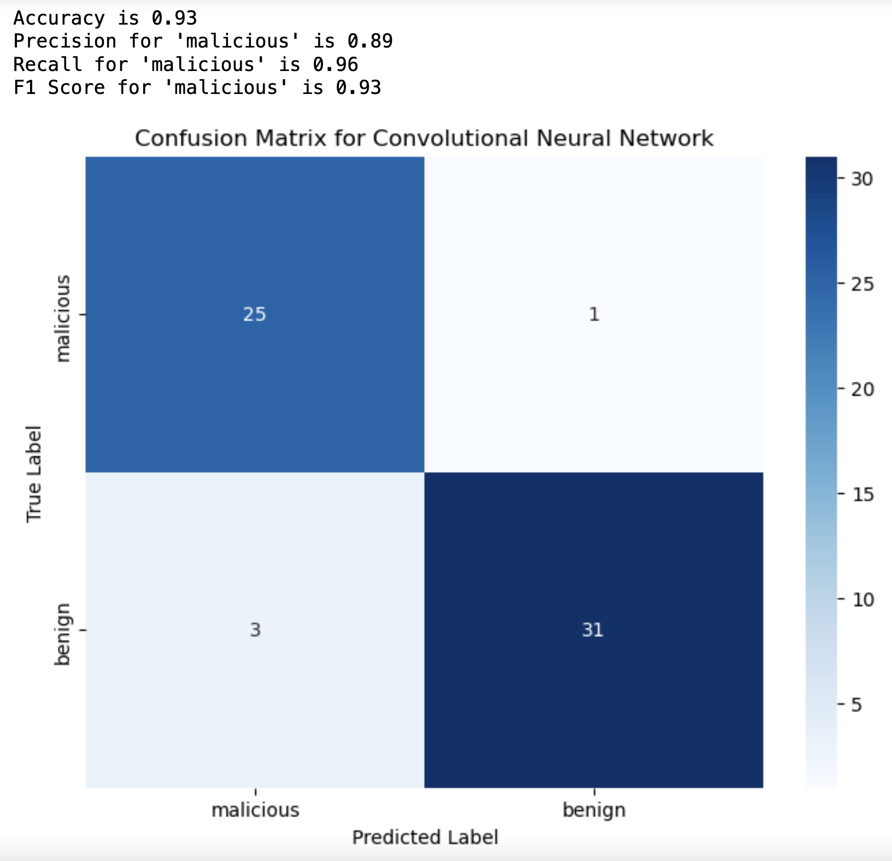

# Email Threat Detection System 🕵️‍♂️

It's not always easy to know whether a file you've downloaded and are preparing to execute is malicious. How can we be better-prepared to tell the difference between benign and malicious executable files?

Complete notebook [here](https://github.com/gregmckenzie88/Springboard-Capstone-3-Email-Threat-Detection-System/blob/main/notebooks/Email%20Threat%20Detection%20System.ipynb)

## Problem Statement

Emily, owner of Pinnacle Dynamics, is experiencing rapid growth in her business. As much of her business revolves around software being exchanged with her clients via email, she wants to be sure that she is not exposing her system to a virus that may compromise the integrity of her business.

Recently, she has received several portable executable files from a new client that could bring in a lot of business in the coming years. How can she be sure that these files are clean before she responds to him in the next 48 hours?

## The Goal

Create a deep neural network, using Tensorflow, with the intent on classifying image representations of portable executable files (PEs) so that, going forward, we can get a better understanding of the risk in opening files we get from unknown authors.

## Data

To inform these predictions, I pulled data from this [Kaggle competition](https://www.kaggle.com/datasets/matthewfields/malware-as-images)

The 'benign' PEs were pulled from PC Magazine's [The Best Free Software of 2020](https://www.pcmag.com/news/best-free-software). The 'malicious' PEs were pulled from [the zoo](https://github.com/ytisf/theZoo).

Images were generated using [Malook](https://github.com/raynt/mallook), which processes each executable file by converting its data, which is read as a binary stream, into a three-color image, where each piece of data is turned into a color pixel, creating a picture that visually represents the file's contents.

## Data Cleaning

The raw image data arrived in a folder structure like this --

    ├── portable_executables
    │   ├── benign
    │   │   └── lanczos_120
    │   │   └── lanczos_300
    │   │   └── lanczos_600
    │   │   └── lanczos_1200
    │   │   └── nearest_120
    │   │   └── nearest_300
    │   │   └── nearest_600
    │   │   └── nearest_1200
    │   ├── malicious
    │   │   └── lanczos_120
    │   │   └── lanczos_300
    │   │   └── lanczos_600
    │   │   └── lanczos_1200
    │   │   └── nearest_120
    │   │   └── nearest_300
    │   │   └── nearest_600
    │   │   └── nearest_1200

-- where 'benign' and 'malicious' are the classification, 'lanczos' and 'nearest' are distance measurements used to interpret the PE files as images, and the following numerical value represents dots-per-inch.

An image representation of each PE would then be distributed in each of these directories, corresponding to the parameters mentioned above.

These parameters were then used to run experiments on which representation type would yield the best-performing model.

Here is an example of one of these images:

I then used OpenCV to trim the axis and enforce dimensions on each image so that each one looked like this:

## EDA

We have 136 unique images, which are distributed like this.

Because the 'benign' class is slightly underrepresented, I upsampled it to get an even 50/50 distribution of each class.

Here, I've plotted a histogram for each pixel value, corresponding to the red, green, and blue color channels, for a randomly selected 'benign' sample.

Note the somewhat 'normal' distribution that is not present in that of a randomly-selected 'malicious' sample.

Here is the same analysis relative to the average of all samples:

At a glance, you can see the malicious samples have a slightly different pattern than the benign ones.

## Modelling

As a baseline model, I chose to leverage transfer learning by using the [MobileNet-V2](https://www.kaggle.com/models/google/mobilenet-v2/frameworks/tensorFlow2/variations/130-224-classification/versions/1?tfhub-redirect=true) layer, which was developed by Google, and was trained on over 1 million images.

After experimenting with various workspace parameters such as distance measurement (nearest, or lanczos) and dots-per-inch (120, 300, 600, 1200), I was able to achieve perfect scores using the 'nearest' measurement with 600 DPI

Here is the summary of this model:

Model: "MobileNet-V2_nearest_600"
| Layer (type) | Output Shape | Param # |
|------------------------|--------------|-----------|
| keras_layer_1 (KerasLayer) | (None, 1001) | 5,432,713 |
| dense_1 (Dense) | (None, 2) | 2,004 |

Total params: 5434717 (20.73 MB)
Trainable params: 2004 (7.83 KB)
Non-trainable params: 5432713 (20.72 MB)

---

I then created a custom convolutional neural network, which at best, generated the following scores:

Here is the summary of this model:

Model: "CNN_nearest_600"
| Layer (type) | Output Shape | Param # |
|-------------------------|---------------------|---------|
| conv2d (Conv2D) | (None, 222, 222, 32)| 896 |
| max_pooling2d (MaxPooling2D) | (None, 111, 111, 32) | 0 |
| conv2d_1 (Conv2D) | (None, 109, 109, 64)| 18,496 |
| max_pooling2d_1 (MaxPooling2D) | (None, 54, 54, 64) | 0 |
| flatten (Flatten) | (None, 186624) | 0 |
| dense_2 (Dense) | (None, 128) | 23,888,000 |
| dropout (Dropout) | (None, 128) | 0 |
| dense_3 (Dense) | (None, 2) | 258 |

Total params: 23907650 (91.20 MB)
Trainable params: 23907650 (91.20 MB)
Non-trainable params: 0 (0.00 Byte)

---

I created a third model, which is similar to the CNN, but leverages Exponential Decay to taper off the learning rate as the accuracy of the model increases, which returned the following scores:

Here is the summary for this model:

Model: "CNN_ED_nearest_600"
| Layer (type) | Output Shape | Param # |
|---------------------------|------------------------|-----------|
| conv2d_4 (Conv2D) | (None, 222, 222, 32) | 896 |
| max_pooling2d_4 (MaxPooling2D) | (None, 111, 111, 32) | 0 |
| conv2d_5 (Conv2D) | (None, 109, 109, 64) | 18,496 |
| max_pooling2d_5 (MaxPooling2D) | (None, 54, 54, 64) | 0 |
| flatten_2 (Flatten) | (None, 186624) | 0 |
| dense_6 (Dense) | (None, 128) | 23,888,000|
| dropout_2 (Dropout) | (None, 128) | 0 |
| dense_7 (Dense) | (None, 2) | 258 |

Total params: 23907650 (91.20 MB)
Trainable params: 23907650 (91.20 MB)
Non-trainable params: 0 (0.00 Byte)

---

Additionally, I calculated the latency for each model to return predictions for each entry in the validation.

The Wall Time results were:

1.33 s for MobileNet-V2_nearest_600

452 ms for CNN_nearest_600

438 ms for CNN_ED_nearest_600

Despite the advantage in this respect for CNN_nearest_600, at this stage in the project, I do not believe it is worth trading off the perfect scores from MobileNet-V2_nearest_600. However, if this model goes to production, and latency becomes a serious issue, this decision can be revisited.
